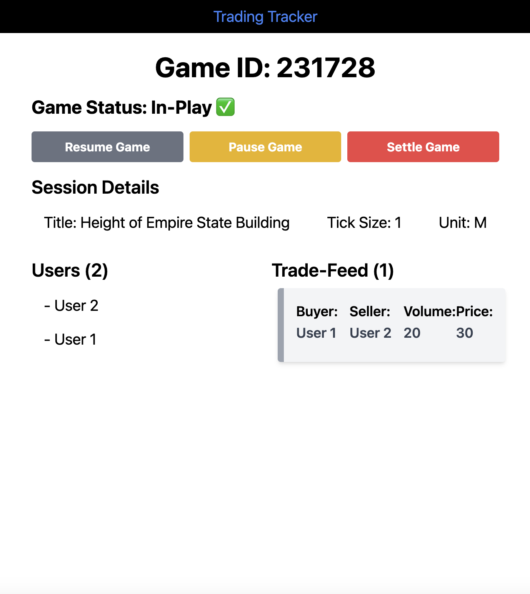

# Trading Tracker
## Production Deployment
Accessible at: [https://trading-tracker.pstefa.com/](https://trading-tracker.pstefa.com/)

## Description
This is a simple trading tracker that acts similarly to a Kahoot. It allows a host to start a trading session around a given quantity, lets say "Height of the Empire State Building", with unit "M". 

The host can then share the session ID with the participants. The participants can then join the session and trade with one another about the given quantity. The host can then end the session, settle the market with a true theoretical and the users will be able to see their profit/loss.

The host can download the data as a JSON file, containing every trade and breakdowns of each user.

## How to run
### Frontend
1. Install Node.js
2. `cd frontend`
3. `npm install`
4. `export REACT_APP_BACKEND_URL=http://localhost:8000`
5. `npm run start`

### Backend
1. `cd server`
2. `docker compose up`

## Screenshots
### Admin UI

### User UI

